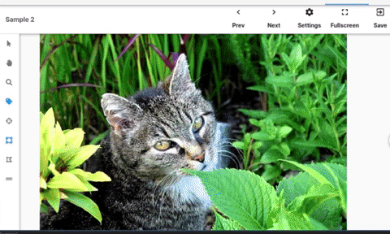

# Universal Data Tool Docs

## Mission

The Universal Data Tool exists to empower anyone, even those without a data science or engineering background, to build the next generation of powerful, useful and impactful Artificial Intelligence applications by providing tooling and standards for the creation, collaboration, labeling and formatting of datasets. **The Universal Data Tool is built to be accessible, easy-to-use, human-friendly and developer-friendly.**

## Editing these Docs

You can edit this documentation by opening a [PR to the markdown docs on Github](https://github.com/UniversalDataTool/docs). Contributions are welcome and very appreciated!

## Getting Help

We have a [Slack channel](https://universaldatatool.slack.com)! Feel free to come in and ask questions. You can also [open an issue on Github](https://github.com/UniversalDataTool/universal-data-tool/issues).

