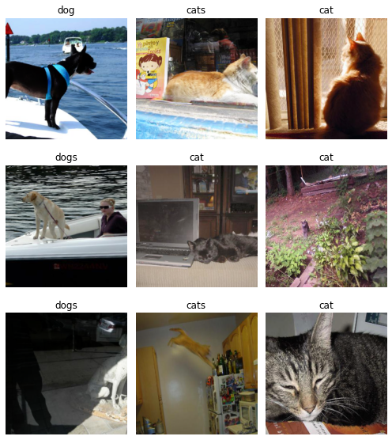

# Fast.ai Image Classification

## Example Dataset

We're going to use [udt-dataset-cats-and-dogs](https://github.com/UniversalDataTool/udt-dataset-cats-and-dogs), a dataset of labeled images of cats and dogs created from [COCO](https://cocodataset.org/). For this guide you don't need to download it directly, because we'll load it in right from our notebook.


## Import CSV Into Pandas Dataframe

We can begin by importing the fastai library, pandas, and our udt.csv file.

```python
from fastai.vision import *
import pandas as pd

url_to_csv = "https://raw.githubusercontent.com/UniversalDataTool/udt-dataset-cats-and-dogs/master/coco_dogs_and_cats.udt.csv"
udt_csv = pd.read_csv(url_to_csv)
```


You can use the udt.json format too, tables are just a nice way to visualize the data!


## Download Images

UDT Datasets just have links to images, so we'll need to download the actual images. Let's do that using the [fast.ai download\_images function](https://docs.fast.ai/vision.utils#download_images).

```python
# Get the lines of our CSV that have sample data
samples = udt_csv[udt_csv["path"].str.contains("samples.")]

# Create two csvs that just have
# our cat image urls and dog image curls

dog_samples = samples[samples["annotation"] == "dog"]
cat_samples = samples[samples["annotation"] == "cat"]

dog_samples.to_csv("dog_urls.csv", columns=["imageUrl"], header=False, index=False)
cat_samples.to_csv("cat_urls.csv", columns=["imageUrl"], header=False, index=False)
```


```python
# Now we can download the images!
download_images("dog_urls.csv", "images/dog" , max_pics=500)
download_images("cat_urls.csv", "images/cat" , max_pics=500)

# Let's make sure all the images are readable
verify_images("images/dog", delete=True, max_size=500)
verify_images("images/cat", delete=True, max_size=500)
```

## Create an ImageDataBunch

From here, everything should should seem pretty normal. We can create an ImageDataBunch from our `images` directory.

```python
data = ImageDataBunch.from_folder("images", train=".", valid_pct=0.2, ds_tfms=get_transforms(), size=224, num_workers=4).normalize(imagenet_stats)

# Let's take a look at the data
data.show_batch(rows=3, figsize=(7,8))
```



## Train a Model

We can now train a model! This is just a simple one, don't forget to fine tune!

```python
learn = cnn_learner(data, models.resnet34, metrics=error_rate)
learn.fit_one_cycle(4)
```


