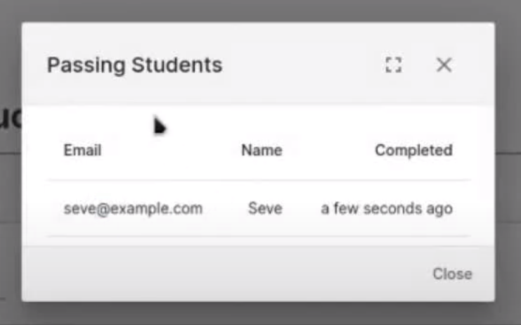

# Getting Started with UDT Courses



## Creating a Course


You'll want to have a dataset before you begin! No labels are needed.


You can create UDT courses online in a couple easy steps. First navigate to [universaldatatool.com/courses](https://universaldatatool.com/courses), then click "Create a Course".

Now you just need to upload your dataset. You can drag and drop or select your dataset here. The samples will be used to construct tests!

You should now be inside the course editor!

## Editing a Course

Every course has an Instructor URL and a Student URL. Your Instructor URL has a secret code in it that allows you to come back, view passing students and edit the course. So don't lose it! After you create a course it should be in your address bar.


Here's an example of an Instructor URL:

[https://universaldatatool.com/courses/course/8f55e988-e2ba-4411-8540-dcd5fd96592d/edit?edit\_key=4eb518683bab1898e1683c8d254d201f](https://universaldatatool.com/courses/course/8f55e988-e2ba-4411-8540-dcd5fd96592d/edit?edit_key=4eb518683bab1898e1683c8d254d201f)

And here's an example of a Student URL:

[https://universaldatatool.com/courses/course/8f55e988-e2ba-4411-8540-dcd5fd96592d](https://universaldatatool.com/courses/course/8f55e988-e2ba-4411-8540-dcd5fd96592d)

See how the Instructor URL is longer and has an "edit\_key"?


We can now add sections, tests, exercises, quizzes and explanations to create a full training course.

### Creating a Course Item

Anytime you see this icon, you can create a new course item.

### Markdown Descriptions

It's just markdown! Put whatever you want inside to explain the motivation of your dataset or specific details. Maybe start with a general overview, then do a deep dive in a second section.

### Question / Quizzes

Quizzes are used to make sure that your labelers read the preceding paragraph.

### Tests / Exercises

**Tests and exercises are the bread and butter of a UDT course.** They make sure your labelers actually know how to label with real examples. 

#### 1. Select the samples

#### 2. Edit the Solution

Here you can add solutions to the dataset. **If your dataset already has labels, they'll automatically be imported.** Your labelers will be tested on these solutions!

#### 3. Configure the Test

Configure your test with instructions, make it a practice exercise etc.

## Sharing a Course with Labelers

Share your course using the "Go to Course" button at the top of the page. That will take you to a page that you can send to all of your labelers.

After a student successfully completes the course, they'll be prompted to enter their email. Their email will now appear in the "Passing Students" dialog.

## Running On-Premise

Check out the [github repository for on-premise instructions](https://github.com/UniversalDataTool/courseware)!

